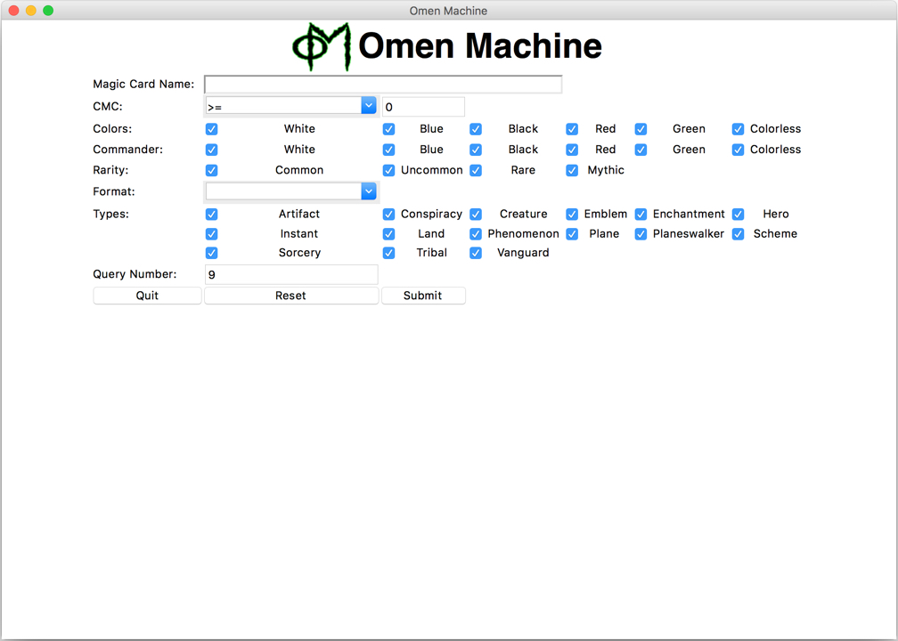
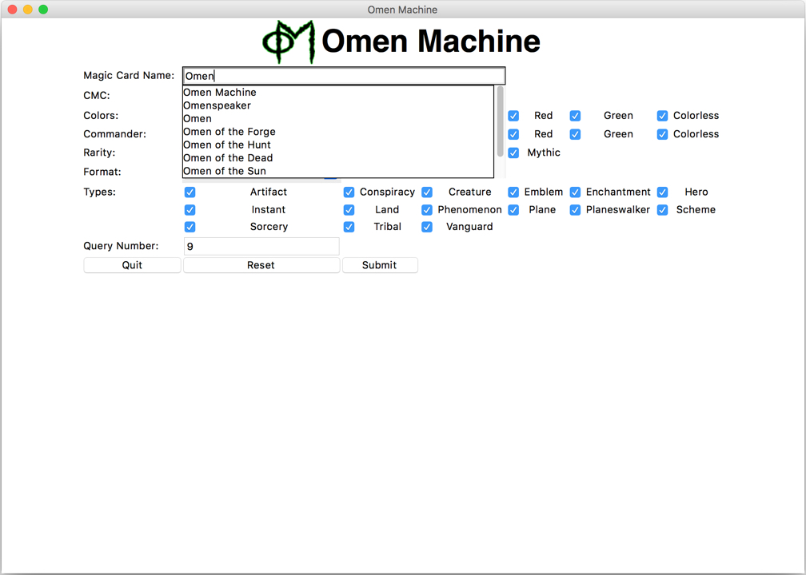
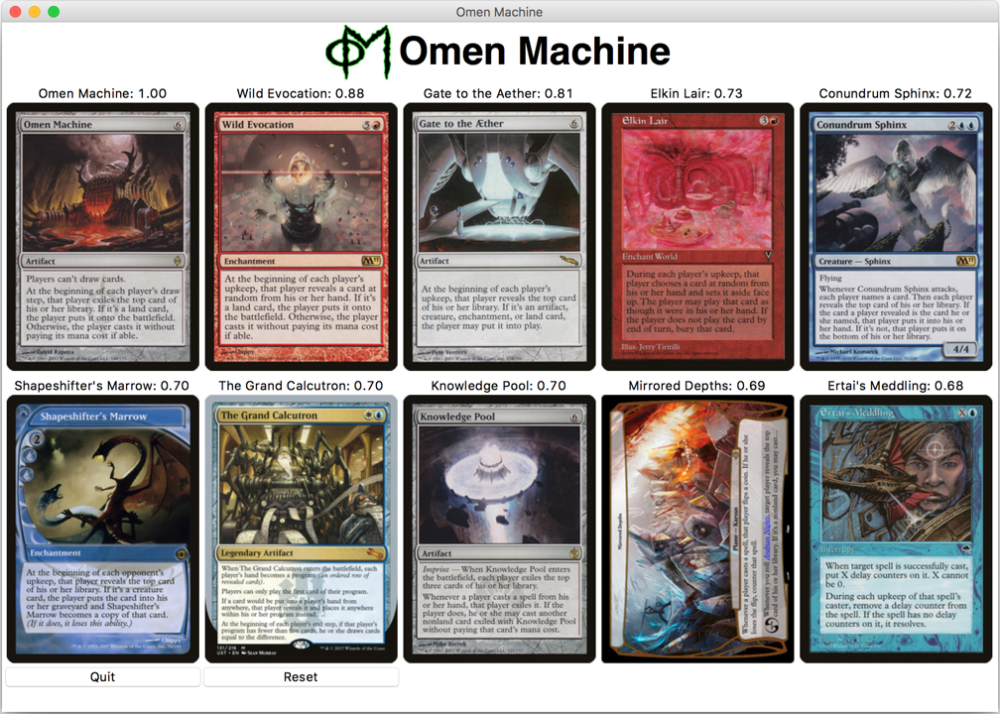

# OmenMachine

A content based recommendation system for `Magic: The Gathering` cards using scikit-learn.
The relevant input for our machine-learning algorithm are the so-called features.
These represent a set of card properties that we use to compare it to other cards.
Examples of interesting features are:

* The oracle text, meaning a description of what the card does.
* The converted mana cost to play the card.
* The type of the card (e.g., Creature or Instant).

The combined features are converted into a count matrix.
Based on this matrix, we compute the cosine similarity, which is stored as a correlation matrix.
The output is a ranking of cards that are most similar to the input card in terms of similarity score. Additional filters, for example color identity or legality in various formats can be applied.

##  Graphical user interface

| GUI |
| - |
| Start screen |
|  |
| Selection |
|  |
| Results screen |
|  |

## Requirements

* Numpy
* Pandas
* JSON
* joblib
* scikit-learn
* re

Optional for GUI:
* tkinter
* urllib.parse
* PIL
* io
* webbrowser

## Copyright

The used information about `Magic: The Gathering` cards are compiled by Scryfall (https://scryfall.com) and is copyrighted by Wizards of the Coast, LLC, a subsidiary of Hasbro, Inc. This project is permitted under the Wizards of the Coast Fan Content Policy.